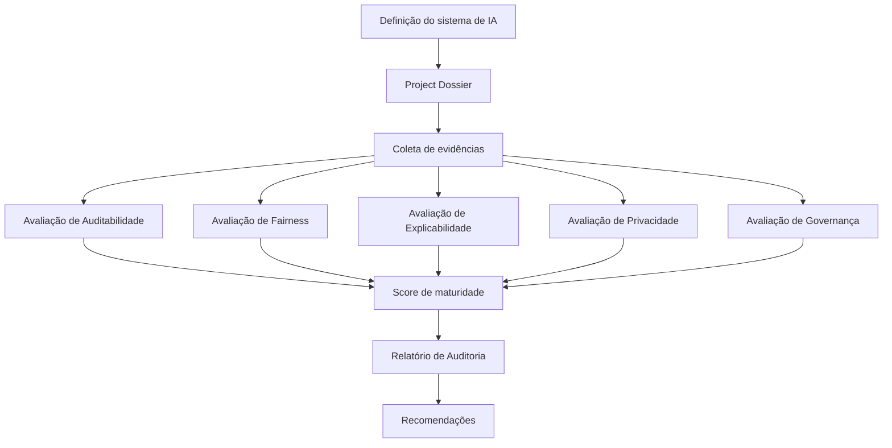

# FIAR Saúde – Framework de Auditoria de IA Responsável

O FIAR Saúde é um framework para documentação, avaliação e auditoria de sistemas de inteligência artificial aplicados à saúde pública.

O objetivo é transformar princípios de Responsible AI em **controles verificáveis, evidências documentadas e avaliações de maturidade**.

## Motivação

Frameworks de Responsible AI frequentemente definem princípios éticos, mas oferecem pouca orientação sobre como implementá-los na prática.

O FIAR propõe uma abordagem baseada em:

- documentação estruturada do sistema
- evidências verificáveis
- avaliação por dimensões de Responsible AI
- relatórios de auditoria
  
## Ciclo de Auditoria FIAR

O processo FIAR é dividido em três fases:

1. Documentação inicial do sistema
2. Avaliação por dimensões de Responsible AI
3. Relatório de auditoria e recomendações

## Estrutura do Repositório

fiar-saude/

templates/
  project_doc.doc
  fairness_report.doc
  explainability_report.doc
  auditability_report.doc

docs/
  fiar_cycle.svg

examples/
  toy_case_project/

README.md

## Como usar o FIAR

1. Criar uma cópia do **Project Dossier Template**

2. Documentar o sistema de IA:
   - contexto
   - escopo técnico
   - artefatos do projeto

3. Produzir os relatórios de dimensão:
   - fairness
   - explicabilidade
   - auditabilidade
   - privacidade
   - governança

4. Realizar a avaliação de maturidade.

5. Produzir o relatório final de auditoria.

## Templates

| Documento | Link |
|---|---|
Project Dossier | link |
Fairness Report | link |
Explainability Report | link |
Auditability Report | link |
Privacy Report | link |
Governance Report | link |

## Dimensões avaliadas

O FIAR avalia sistemas de IA em cinco dimensões:

- Auditabilidade
- Explicabilidade
- Justiça (Fairness)
- Privacidade
- Governança

## Exemplo

Um estudo de caso ilustrativo está disponível em:

examples/toy_case_project

## Referência

Se você usar o framework, cite:

Vasconcelos et al. (2026)
FIAR Saúde – Responsible AI Audit Framework for Public Health Systems

## Licença

MIT License
